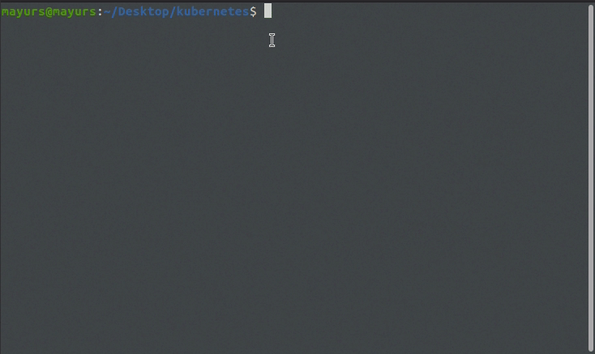

# licensor

> Inject custom license header in your source code, quickly.

### Installation

[Download latest binary.](https://github.com/Marvin9/licensor/releases/latest)


**Linux**

Unzip download and make command access global.

```sudo mv /path/to/zip/licensor /usr/local/bin```

### Usage


**Using command line**

```
licensor -project ./ -ext go js -license ./LICENSE.md
```

<table>
    <tr>
        <th>Flag</th>
        <th>Usage</th>
        <th>Example</th>
        <th>Required</th>
        <th>Default</th>
    </tr>
    <tr>
        <td>-project</td>
        <td>Project directory path.</td>
        <td>
            <code>
                licensor -project ./
                <br/>
                licensor -project ./app
            </code>
        </td>
        <td>false</td>
        <td>./</td>
    </tr>
    <tr>
        <td>-ext</td>
        <td>Extensions of files which you want to add license header</td>
        <td>
            <code>
                licensor -ext go py c cpp
            </code>
        </td>
        <td>true</td>
        <td></td>
    </tr>
    <tr>
        <td>-license</td>
        <td>
        Custom license template which you want to add in source code. You can provide path or url.
        </td>
        <td>
            <code>
                licensor -license Your-License-Template.txt 
            </code>
            <br/>
            <code>
                licensor -license url-that-returns-license-text
            </code>
        </td>
        <td>true</td>
        <td></td>
    </tr>
    <tr>
        <td>-template</td>
        <td>Variables value for your license template</td>
        <td>
            <code>
                licensor -template "{\"foo\":\"bar\"}"
            </code>
        </td>
        <td>Only if license template required</td>
    </tr>
    <tr>
        <td>-ignore</td>
        <td>File(s)/Dir(s) to ignore</td>
        <td>
            <code>
                licensor -ignore ./foo ./bar/a.go
            </code>
        </td>
        <td>false</td>
        <td></td>
    </tr>
</table>

**Using YML**

```
licensor
```

- licensor.yml
```yml
project: [project directory path] [default: "./"]
extensions: [required]
 - go
 - py
 - c
license: [license file path or url] [required]
template:
 foo: bar
 baz: bak
ignore:
 - ./foo [directory]
 - ./bar/baz.go [file]
```

### Demo


